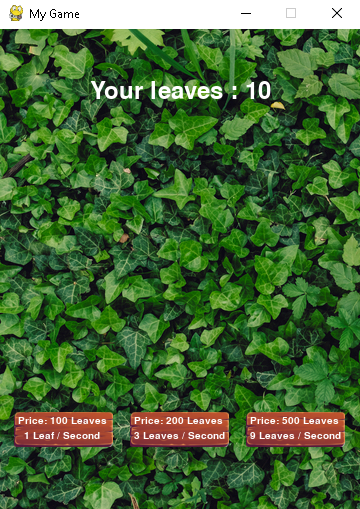

## Clicker
### Plot
Girl decided to collect the biggest leaves' collection ever and you are to help her.
### Gameplay
Each 'Space' click imitates collecting 1 leaf. There are some dwarfs that can help you to make girl's dream true faster.
#### Dwarfs
The smallest one collects 1 leaf per second, but he needs 100 leaves to be sure that you are highly motivated to continue your work. Secondary will collect 3 leaves per second for 200 leaves. The biggest one is very fast (9 leaves per second), but requires 500 leaves for his job.
### This is how game looks

Game ends when you reach 100000 leaves.
Enjoy and good luck!
